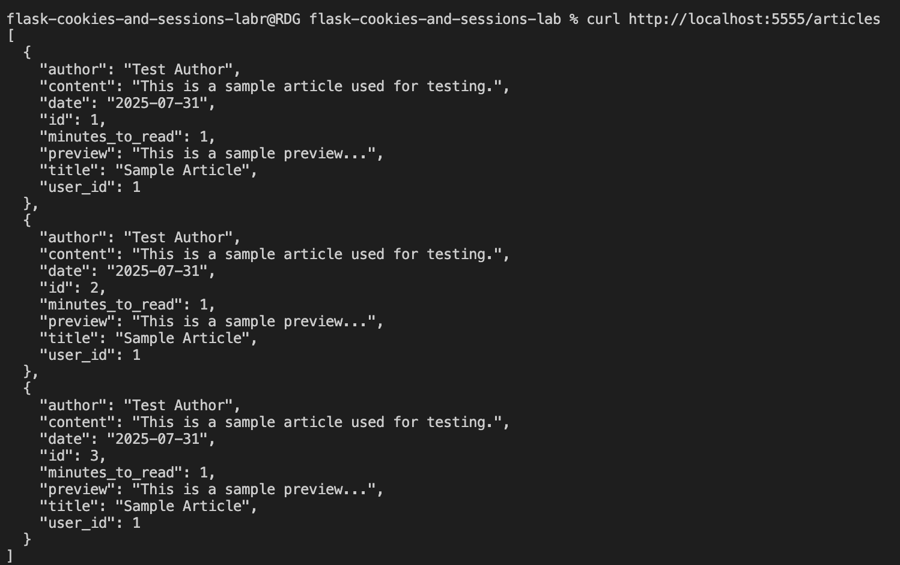

# Flask Cookies & Sessions Lab

This API demonstrates using Flask sessions to limit article page-views per session.

## Table of contents

- [Demo](#demo)
- [Installation](#installation)
- [Running the server](#running-the-server)  
- [Testing](#testing)
- [API Endpoints](#api-endpoints)  

---

## Demo

## Installation  

    Bash:
pipenv install && pipenv shell
npm install --prefix client
cd server
flask db upgrade
python seed.py

    Open a second terminal which will be responsible for running the React app:

npm start --prefix client

## Running the server

    Bash:
flask run --port=5555

## Testing

    Bash:
pytest

## API Endpoints

- **GET** `/articles`  
Returns the list of sample articles:

- **GET** `/articles/<id>`  

- **GET** `/clear`  
  Resets session['page_views'] to 0
